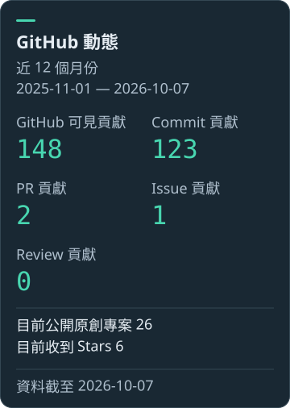

<!-- Generated by scripts/cli.mjs. Edit config/ and this template instead. -->
# Jacky

在這裡整理我的開發作品、工具實驗與實作紀錄。

AI 工具整合 · Web 原型整理 · 開發工作流程

## 精選作品

### [MingMing AI Product Engineering Loop](https://github.com/jacky105402002/MingMing-AI-Product-Engineering-Loop)

將 AI 輔助開發整理成可追蹤、可審查、可測試的產品工程流程，串連規劃、實作與文件維護。

[查看原始碼](https://github.com/jacky105402002/MingMing-AI-Product-Engineering-Loop)

### [AI 前端原型整理工具](https://github.com/jacky105402002/ai-web-package-react)

把 AI 工具產生的前端原型整理成可維護、可建置的 React 與 Vite 靜態網站專案，附部署與轉換檢查文件。

[查看原始碼](https://github.com/jacky105402002/ai-web-package-react)

## GitHub 動態

統計資料尚未取得。連接 GitHub 資料後，這裡會顯示活動摘要、連續貢獻、語言分布與貢獻圖表。

深海青綠 · 自行產生的 SVG 卡片 · [製作與維護說明](docs/MAINTENANCE.md)
